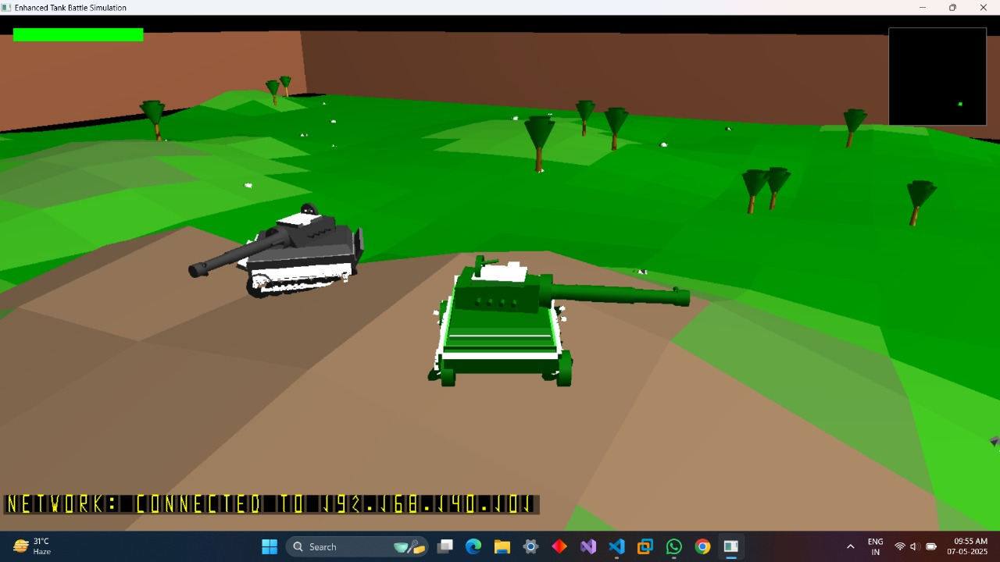
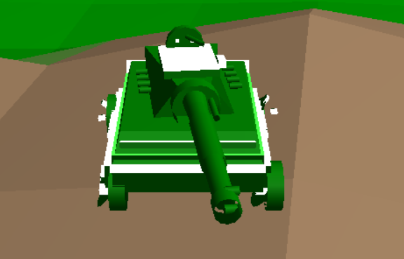
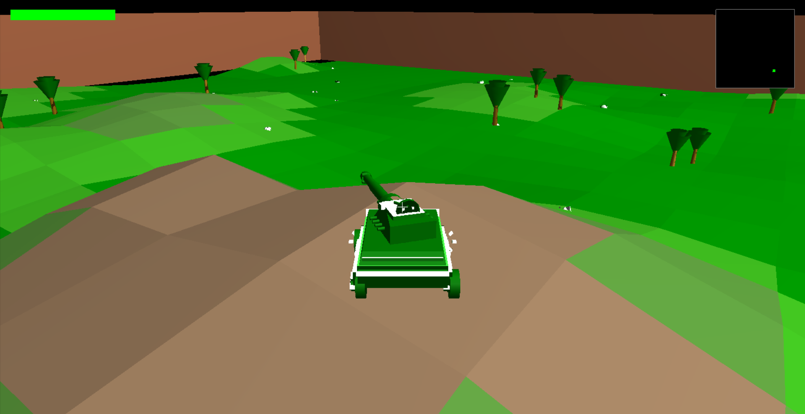
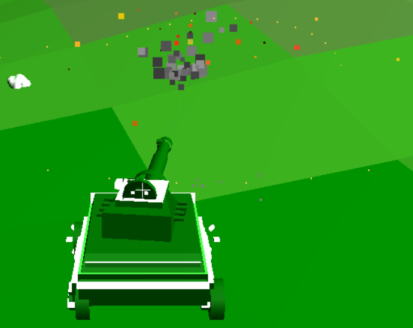
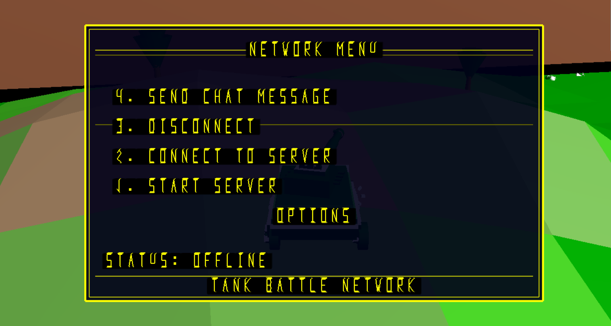

# 🎮 Tank Battle LAN Multiplayer


<!-- SEO Keywords -->
<!--
tank game, 3D game, C++ game, OpenGL game, tank simulation, tank battle, multiplayer game,
game development, 3D graphics, particle effects, physics simulation, game programming,
computer graphics, UDP networking, LAN multiplayer, game physics, tank combat,
third-person camera, retro UI, game project, C++ project, OpenGL project
-->

A high-performance 3D tank battle game with **LAN Multiplayer** as its core feature. Built with C++, OpenGL, and freeglut, this game lets you battle friends over local network in exciting tank combat. Features realistic physics, immersive 3D graphics, and a third-person camera view for an engaging multiplayer experience.

<p align="center">
  
</p>

## 📋 Table of Contents

- [Features](#-features)
- [Controls](#-controls)
- [Screenshots](#-screenshots)
- [Technical Implementation](#-technical-implementation)
- [Requirements](#-requirements)
- [Building and Running](#-building-and-running)
- [Multiplayer Setup](#-multiplayer-setup)
- [Project Structure](#-project-structure)
- [Future Enhancements](#-future-enhancements)
- [License](#-license)
- [Acknowledgements](#-acknowledgements)
- [Contact](#-contact)

<!--
NOTE: Uncomment these sections after adding your gameplay GIF and YouTube video

## 🎬 Gameplay Preview

<p align="center">
  
</p>

## 📹 Full Gameplay Video

[](https://www.youtube.com/watch?v=YOUR_VIDEO_ID)
-->

<!-- INSTRUCTIONS FOR ADDING MEDIA:
1. Create a gameplay GIF (5-10 seconds) showing an exciting moment
2. Save it as "gameplay.gif" in the screenshots folder
3. Record a 2-3 minute gameplay video and upload to YouTube
4. Replace YOUR_VIDEO_ID with your actual YouTube video ID
5. Uncomment the sections above
6. Delete these instructions
-->

## ✨ Features

### 🎯 Gameplay

- **Realistic Tank Physics**: Experience authentic tank movement with acceleration, deceleration, and terrain-based handling
- **Third-Person Camera**: Dynamic camera system that follows your tank for immersive gameplay
- **Combat Mechanics**: Engage in tactical battles with precise aiming and realistic projectile physics
- **Health System**: Monitor your tank's health and strategically avoid enemy fire
- **Game Over System**: Clear win/lose conditions with an intuitive retry mechanism

### 🌍 Environment

- **Dynamic Terrain**: Navigate through procedurally generated terrain with height variations
- **Environmental Objects**: Maneuver around trees, rocks, and other obstacles
- **Collision Detection**: Realistic collision handling between tanks, projectiles, and terrain

### 🎭 LAN Multiplayer

- **Real-time Tank Battles**: Challenge friends to intense 1v1 tank duels over your local network
- **Low-Latency UDP Protocol**: Enjoy responsive, lag-free multiplayer combat with optimized networking
- **Seamless Synchronization**: Experience perfectly synced tank movements, projectiles, and battle events
- **In-Game Chat**: Communicate with your opponent during gameplay
- **Easy Connection**: Simple server-client setup with minimal configuration
- **Multiplayer Health System**: Damage tracking and health synchronization between players

### 🎬 Visual Effects

- **Particle System**: Spectacular explosions, muzzle flashes, and smoke effects
- **Realistic Projectiles**: Missiles with smoke trails and realistic flight paths
- **Tank Animations**: Animated tank tracks and turret rotation
- **Retro UI**: Stylish user interface with a classic gaming aesthetic

## 🎮 Controls

| Action            | Control                   |
| ----------------- | ------------------------- |
| Move Forward      | W / Up Arrow              |
| Move Backward     | S / Down Arrow            |
| Turn Left         | A / Left Arrow            |
| Turn Right        | D / Right Arrow           |
| Aim Turret        | Mouse Movement            |
| Fire              | Left Mouse Button / Space |
| Toggle Fullscreen | F11                       |
| Show Network Menu | CTRL                      |
| Chat              | T                         |
| Exit              | Esc                       |

## 🖼️ Screenshots

<p align="center">
  
  
</p>

<p align="center">
  
  
</p>

## 🛠️ Technical Implementation

### Graphics

- **OpenGL Rendering**: Custom rendering pipeline for efficient 3D graphics
- **Custom Models**: Detailed tank models with separate components for hull, turret, and tracks
- **Particle Effects**: Advanced particle system for realistic visual effects
- **Text Rendering**: Custom text rendering system for UI elements

### Physics

- **Tank Movement**: Realistic physics for tank acceleration, deceleration, and rotation
- **Terrain Interaction**: Height-based terrain movement with slope effects
- **Projectile Ballistics**: Accurate projectile physics for realistic bullet trajectories

### Networking

- **LAN Multiplayer**: Dedicated networking system for local area network play
- **UDP Protocol**: Fast, low-overhead communication for real-time gameplay with minimal latency
- **Client-Server Architecture**: Reliable connection handling with flexible server and client roles
- **State Synchronization**: Efficient synchronization of tank positions, rotations, and health
- **Message System**: Robust message handling for game events, bullet firing, and hit detection
- **Winsock Implementation**: Windows Socket API for reliable network communication

## 📋 Requirements

- Windows 10/11
- C++17 compatible compiler
- OpenGL 4.5+
- freeglut 3.2.1+
- Network adapter for multiplayer functionality

## 🚀 Building and Running

1. Clone the repository:

```bash
git clone https://github.com/Keshav-Bansal05/Tank-Battle-LAN-Multiplayer.git
cd Tank-Battle-LAN-Multiplayer
```

2. Compile the project:

```bash
g++ -o EnhancedTankGame.exe EnhancedTankGame.cpp NetworkManager.cpp -lopengl32 -lglu32 -lgdi32 -lws2_32
```

3. Run the game:

```bash
./EnhancedTankGame.exe
```

## 🔄 LAN Multiplayer Setup

Play with friends on your local network in just a few simple steps!

### Hosting a Game (Server)

1. Launch the game
2. Press 'CTRL' to open the network menu
3. Select "Start Server"
4. The game will display your IP address - share this with your friend
5. Wait for your friend to connect
6. Once connected, both players will enter the battle arena automatically

### Joining a Game (Client)

1. Launch the game
2. Press 'CTRL' to open the network menu
3. Enter the host's IP address in the input field
4. Select "Connect to Server"
5. Once connected, you'll automatically enter the battle arena

### Multiplayer Tips

- Ensure both computers are on the same local network
- Disable firewalls or add exceptions if connection issues occur
- Use the in-game chat (press T) to communicate with your opponent
- Tank health is synchronized between players in real-time
- When a tank is destroyed, the game displays the winner and offers a retry option

## 🧩 Project Structure

```
Tank-Battle-LAN-Multiplayer/
├── EnhancedTankGame.cpp    # Main game file
├── NetworkManager.h        # Networking header
├── NetworkManager.cpp      # Networking implementation
├── external/               # External dependencies
│   └── freeglut/           # freeglut library
├── screenshots/            # Game screenshots
└── README.md               # Project documentation
```

## 🔮 Future Enhancements

- **Advanced Shader Effects**: Implementation of modern shader techniques for enhanced visuals
- **External 3D Model Loading**: Support for loading external 3D models in common formats
- **Enhanced AI**: Computer-controlled opponents for single-player mode
- **Additional Weapons**: Multiple weapon types with different damage and effects
- **Map Editor**: Custom map creation tool for designing battle arenas

## 📜 License

This project is licensed under the MIT License - see the LICENSE file for details.

## 🙏 Acknowledgements

- OpenGL for the powerful graphics API
- freeglut for the OpenGL utility toolkit
- All contributors and testers who helped improve the game

---

<p align="center">
  <i>Developed with ❤️ by Keshav Bansal & Dhruv Aggarwal</i>
</p>

## 📬 Contact

If you have any questions, suggestions, or would like to contribute to this project, feel free to reach out:

### Keshav Bansal

- **Email**: [bansalkeshav8888@gmail.com](mailto:bansalkeshav8888@gmail.com)
- **GitHub**: [@Keshav-Bansal05](https://github.com/Keshav-Bansal05)
- **LinkedIn**: [Keshav Bansal](https://www.linkedin.com/in/keshavbansal06)

### Dhruv Aggarwal

- **Email**: [dhruvngh2005@gmail.com](mailto:dhruvngh2005@gmail.com)
- **LinkedIn**: [Dhruv Aggarwal](https://www.linkedin.com/in/dhruv-aggarwal-2149bb250)
